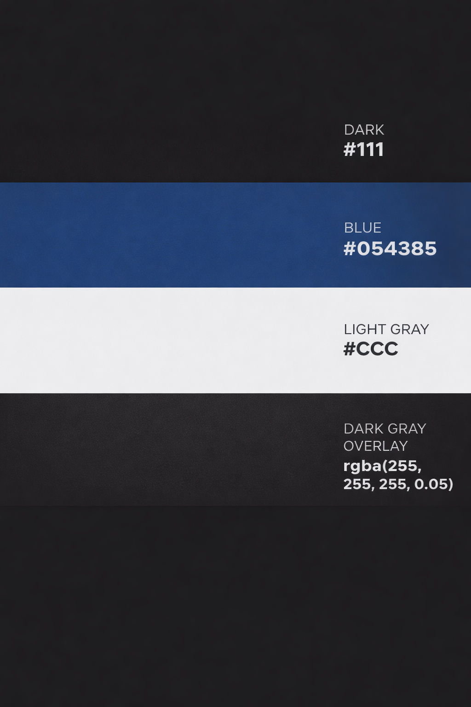

# [sky-fly](https://raigonlab.github.io/sky-fly)

Developer: Railson Goncalves ([raigonlab](https://www.github.com/raigonlab))

---

## Project Introduction and Rationale

Sky-Fly is a modern, responsive website designed to promote aerial flight experiences. The project allows users to explore different flight experiences, view inspiring visuals, and easily get in touch to book their own adventure.

The target audience includes tourists, adventure seekers, and individuals looking for unique outdoor experiences. The website focuses on creating an emotional connection through visuals while maintaining a clean and intuitive interface.

The rationale behind this project was to combine design and functionality in a simple but effective way. As a designer and artist, I wanted to create something visually engaging while also applying solid front-end development practices. This project represents the balance between aesthetics and usability.

---

source: https://ui.dev/amiresponsive?url=https://raigonlab.github.io/sky-fly

---

## UX

### The 5 Planes of UX

#### 1. Strategy

**Purpose**

* Showcase flight experiences in a visually engaging way
* Encourage users to explore and book

**Primary User Needs**

* Understand the experience
* View images and inspiration
* Contact easily

**Business Goals**

* Increase booking inquiries
* Build a strong visual identity
* Deliver a smooth user experience

---

#### 2. Scope

**Features**

* Responsive navigation
* Gallery
* Contact form
* CTA sections

**Content Requirements**

* Clear descriptions
* Strong visuals
* Simple booking flow

---

#### 3. Structure

**Information Architecture**

* Navbar with clear navigation
* CTA buttons placed strategically

**User Flow**

1. User lands on homepage
2. Explores flight experience
3. Views gallery
4. Goes to contact page
5. Submits booking request

---

#### 4. Skeleton

Wireframes were created using Figma for mobile and desktop layouts.

---

#### 5. Surface

**Visual Design**

* Minimal and clean layout
* Strong contrast and readability

---

## Colour Scheme

* Dark, modern scheme focused on clarity and contrast:

* Background: #111
* Accent: #054385
* Text: #ccc
* Overlays: rgba(255, 255, 255, 0.05)

Clean, minimal, and easy to read.

---

## Typography

* Clean and modern typography for readability
* Font Awesome used for icons

---

## Wireframes

Wireframes were created to define layout and structure across devices, starting with low-fidelity wireframes, which are simple sketches focused on basic layout, content placement, and user flow without visual details like colors or typography.

| Page    | Screenshot                                       |
| ------- | ------------------------------------------------ |
| Home    |        |
| Gallery |  |
| Contact |  |

---

## User Stories

| Target    | Expectation                         | Outcome                           |
| --------- | ----------------------------------- | --------------------------------- |
| As a user | I want to understand the experience | so I can decide if it's for me    |
| As a user | I want to see visuals               | so I can feel inspired            |
| As a user | I want to contact easily            | so I can book quickly             |
| As a user | I want responsive design            | so I can use any device           |
| As a user | I want a 404 page                   | so I know when something is wrong |

---

## Features

### Existing Features

| Feature      | Description                             |
| ------------ | --------------------------------------- |
| Navbar       | Responsive navigation across all pages  |
| Gallery      | Image grid showcasing experiences       |
| Contact Form | Allows users to submit booking requests |
| CTA          | Encourages user interaction             |
| 404 Page     | Custom error handling                   |
| Favicon      | Branding element                        |

---

### Future Features

* Payment integration
* User accounts
* Weather section

---

## Tools & Technologies

* HTML5
* CSS3
* Bootstrap
* Git & GitHub
* GitHub Pages
* Figma
* Font Awesome
* ChatGPT / Gemini / Claude

---

## Agile Development Process

GitHub Projects and Issues were used to plan and manage the project.

---

## Testing

All testing details are available in:

👉 [TESTING.md](TESTING.md)

---

## Deployment

The project was deployed using GitHub Pages.

Live link: https://raigonlab.github.io/sky-fly

---

## Credits

### Content

* Bootstrap Documentation
* Code Institute materials
* ChatGPT (debugging & explanations)

---

### Media

* Images generated with AI tools
* Icons from Font Awesome

---

## Acknowledgements

Special thanks to my mentor Tim Nelson for his guidance and support throughout the project.

---
