# Testing

> [!NOTE]
> Return back to the [README.md](README.md) file.

---

## Code Validation

### HTML

I have used the recommended [HTML W3C Validator](https://validator.w3.org) to validate all of my HTML files using the deployed URLs.

| File                | URL                                                                                      | Screenshot                                                            | Notes           |
| ------------------- | ---------------------------------------------------------------------------------------- | --------------------------------------------------------------------- | --------------- |
| 404.html            | https://validator.w3.org/nu/?doc=https://raigonlab.github.io/sky-fly/404.html            | 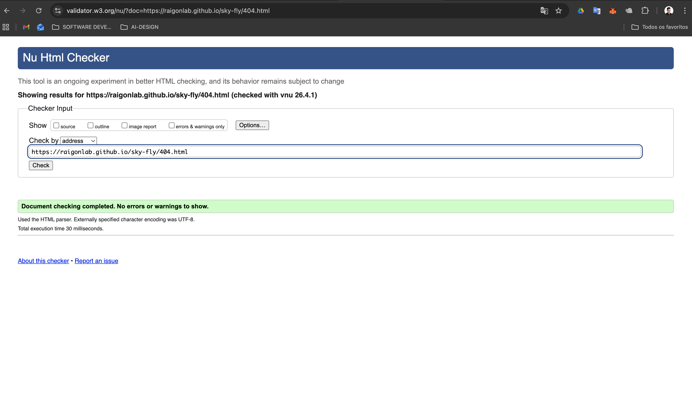             | No major errors |
| contact.html        | https://validator.w3.org/nu/?doc=https://raigonlab.github.io/sky-fly/contact.html        | 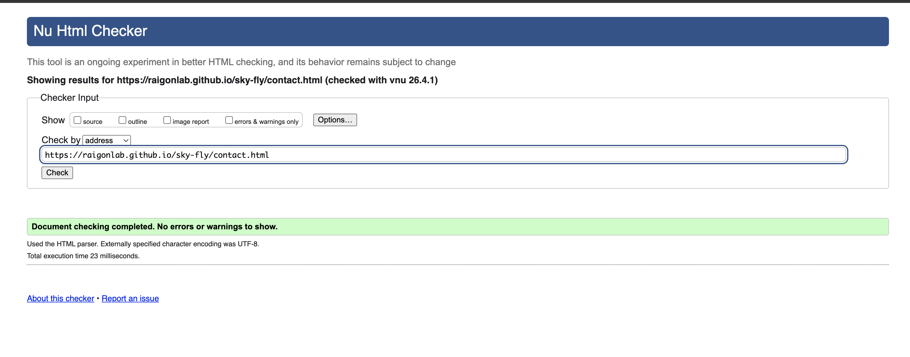     | No major errors |
| fly-experience.html | https://validator.w3.org/nu/?doc=https://raigonlab.github.io/sky-fly/fly-experience.html | 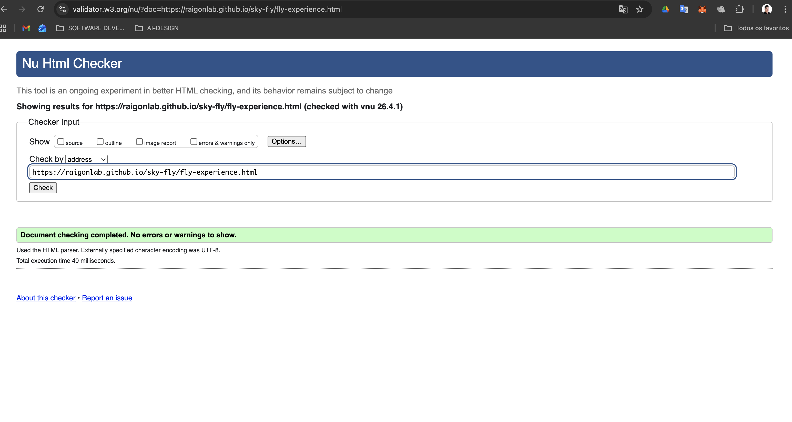  | No major errors |
| gallery.html        | https://validator.w3.org/nu/?doc=https://raigonlab.github.io/sky-fly/gallery.html        | 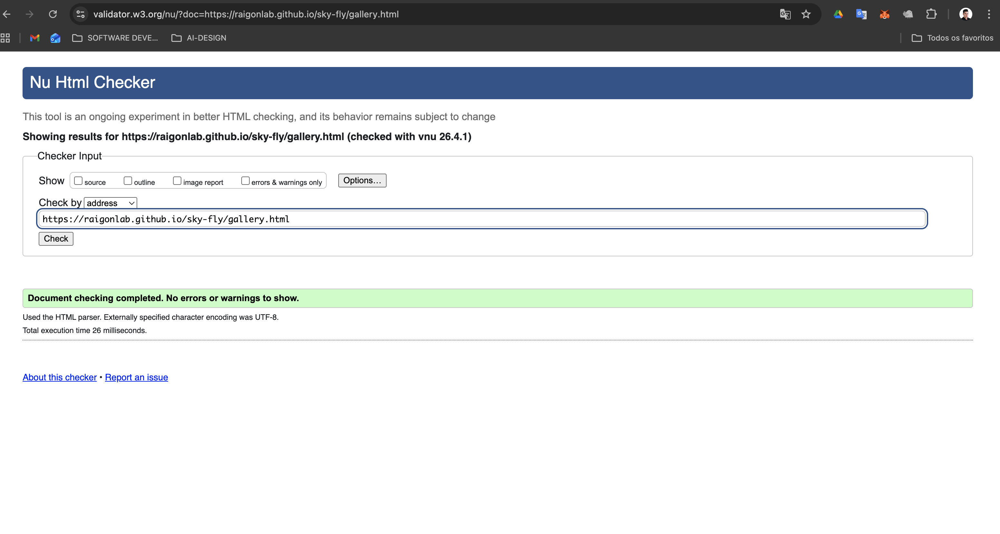     | No major errors |
| index.html          | https://validator.w3.org/nu/?doc=https://raigonlab.github.io/sky-fly/index.html          | 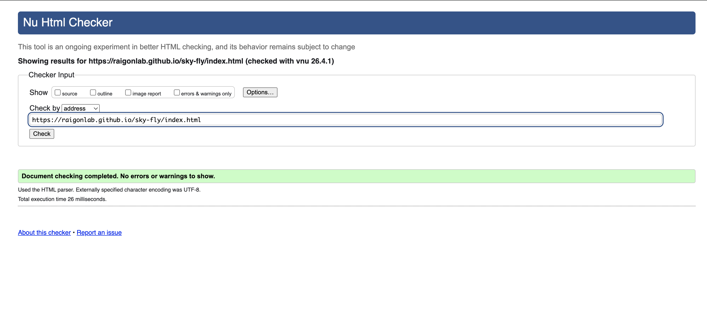         | No major errors |
| thank-you.html      | https://validator.w3.org/nu/?doc=https://raigonlab.github.io/sky-fly/thank-you.html      | 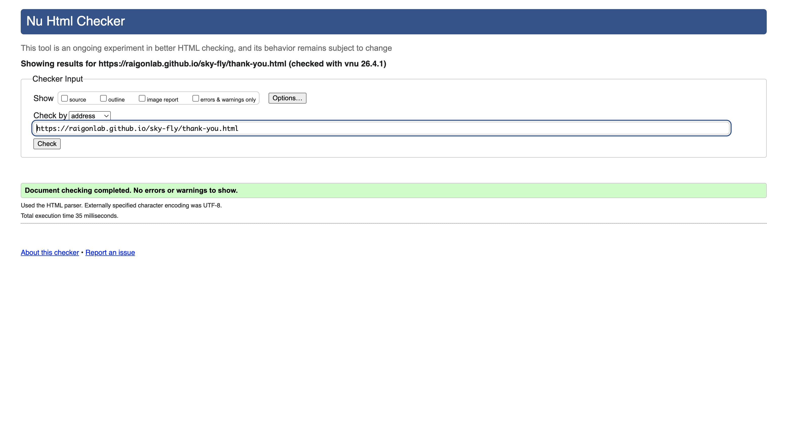 | No major errors |

---

### CSS

I have used the recommended [CSS Jigsaw Validator](documentation/testing/css-testing.png) to validate my CSS file.

| File      | URL                                                                                   | Screenshot                                                       | Notes                                         |
| --------- | ------------------------------------------------------------------------------------- | ---------------------------------------------------------------- | --------------------------------------------- |
| style.css | https://jigsaw.w3.org/css-validator/validator | 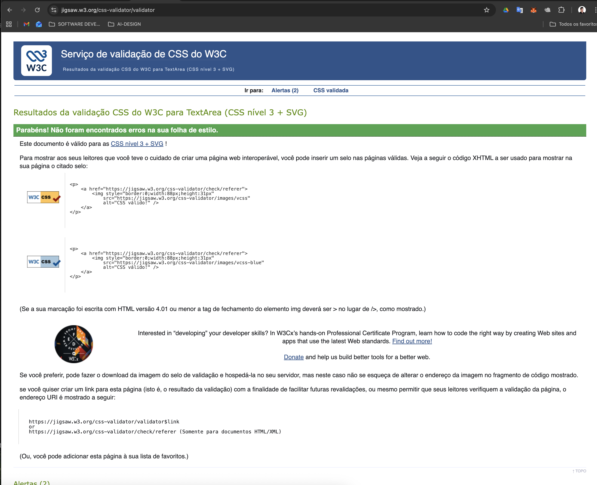 | Minor warnings related to Bootstrap (ignored) |

---

## Responsiveness

The project was tested across multiple screen sizes using browser developer tools and real device simulation.

| Page      | Mobile                                                       | Tablet                                                       | Desktop                                                        | Notes                 |
| --------- | ------------------------------------------------------------ | ------------------------------------------------------------ | -------------------------------------------------------------- | --------------------- |
| Home      |       |       | 
| Fly Experience      |       |       |       | Works as expected     |
| Gallery   |    |    |    | Grid adapts correctly |
| Contact   |    |    |    | Form remains usable   |
| Thank You |  |  |  | Layout consistent     |
| 404       | 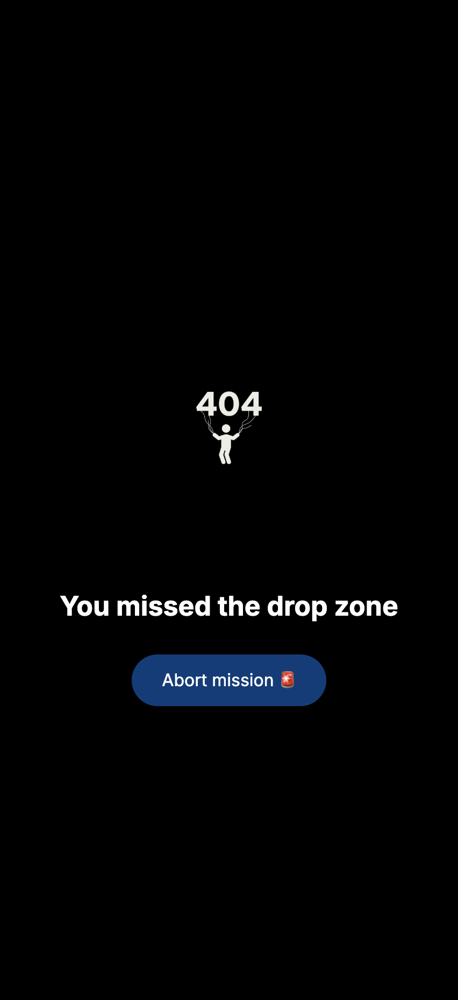       | 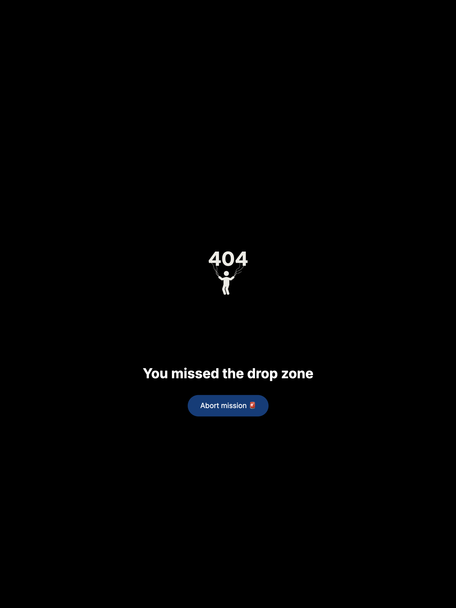       |        | Clear error message   |

---

## Browser Compatibility

The project was tested across major browsers.

| Page    | Chrome                                               | Firefox                                                | Safari                                               | Notes           |
| ------- | ---------------------------------------------------- | ------------------------------------------------------ | ---------------------------------------------------- | --------------- |
| Home    |     |     |     | Works correctly |
| Gallery |  |  |  | No issues       |
| Contact |  |  |  | Form works      |
| 404     | 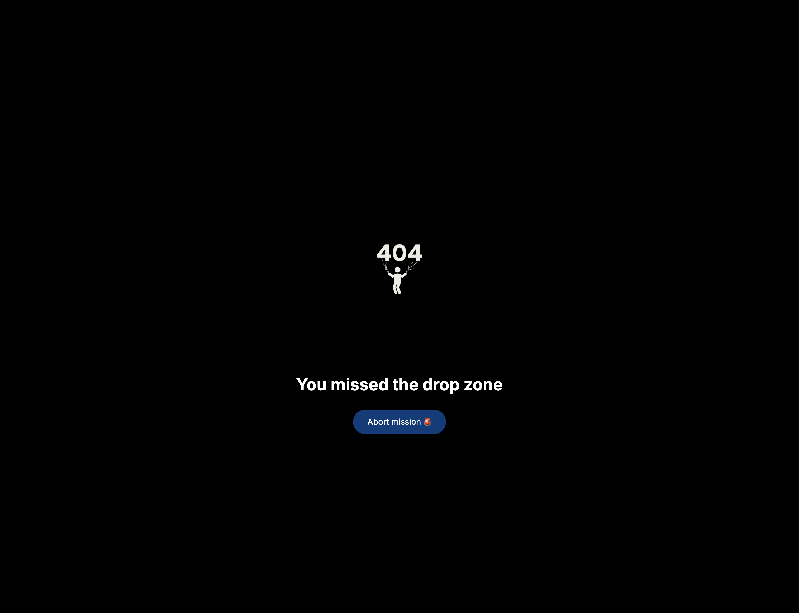     | 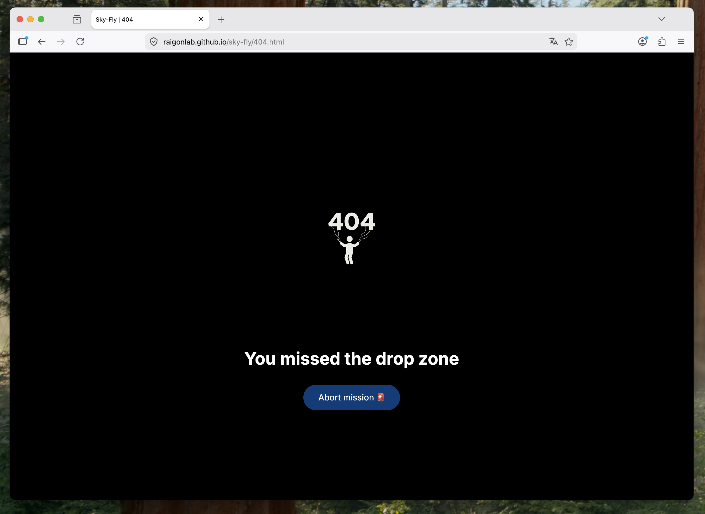     | 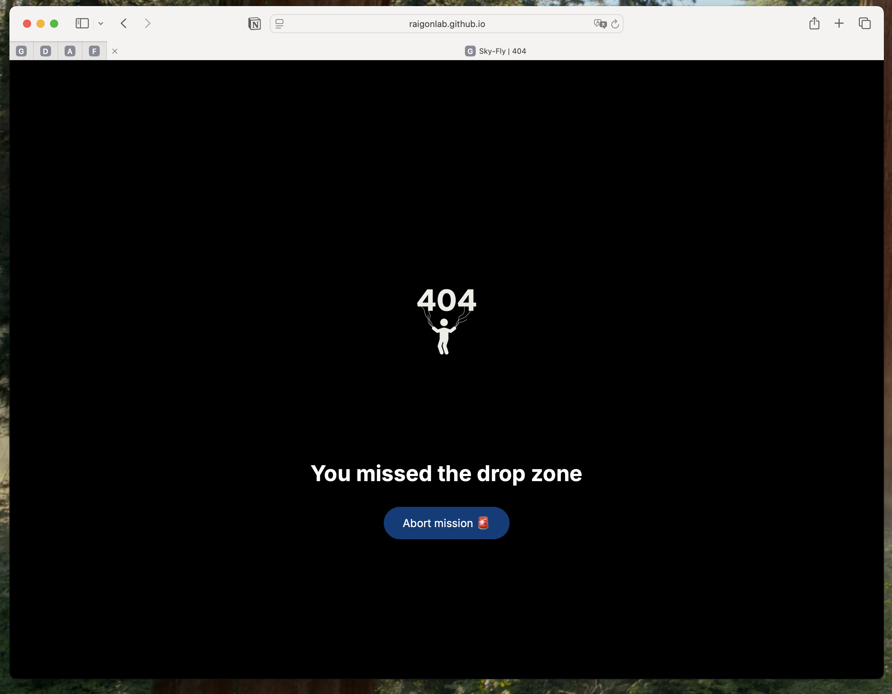     | Works correctly |

---

## Lighthouse Audit

Lighthouse audits were performed on all pages.

| Page    | Mobile                                                 | Desktop                                                  |
| ------- | ------------------------------------------------------ | -------------------------------------------------------- |
| Home    | 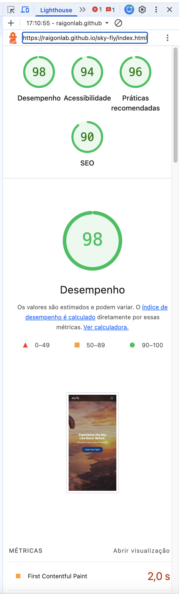    | 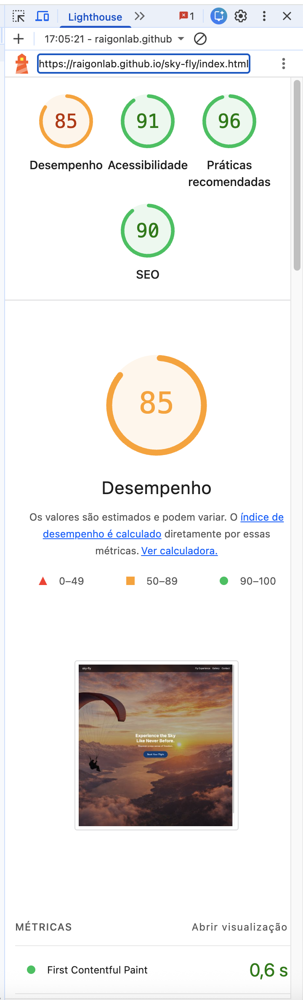    |
| Gallery | 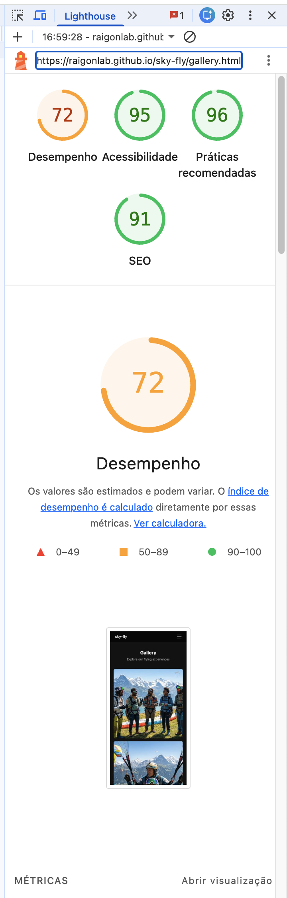 | 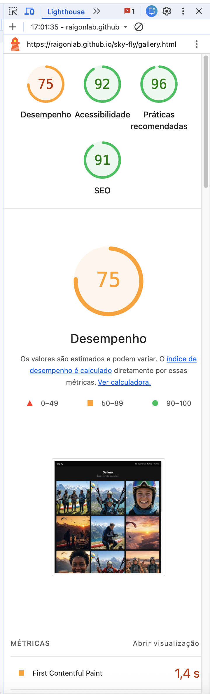 |
| Contact | 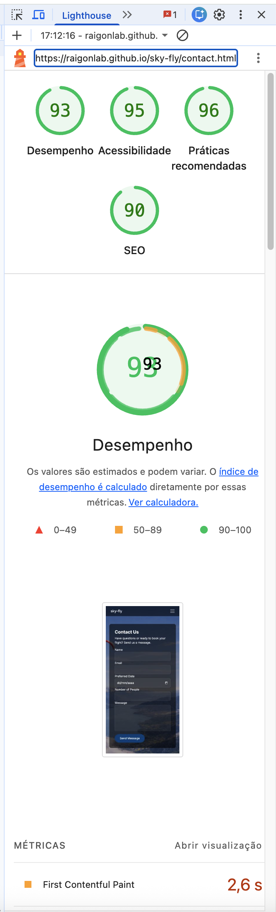 | 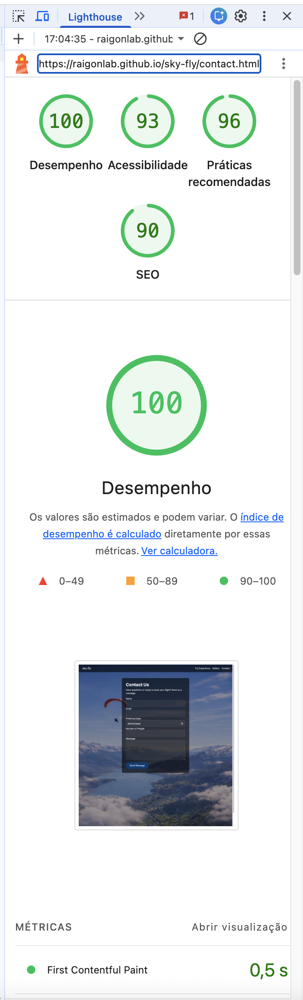 |
| 404     | 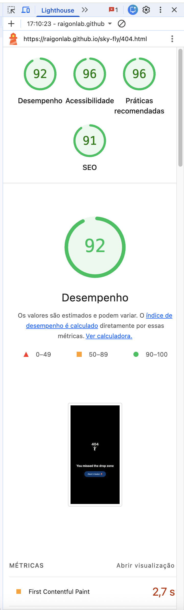     | 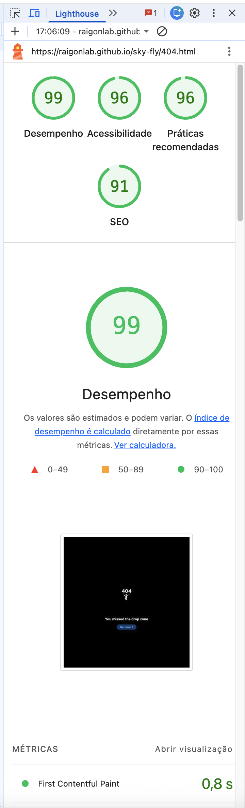     |

---

## Defensive Programming

Manual testing was conducted to ensure correct user interactions.

| Page       | Expectation                         | Test                        | Result                 |
| ---------- | ----------------------------------- | --------------------------- | ---------------------- |
| Contact    | Form should not submit empty fields | Tried submitting empty form | Blocked successfully   |
| Contact    | Email must be valid                 | Inserted invalid email      | Validation triggered   |
| Navigation | Links should work                   | Clicked all links           | All working            |
| Gallery    | Images should display correctly     | Tested resizing             | Responsive and correct |
| 404        | Invalid URL should show error page  | Accessed random URL         | 404 page displayed     |

---

## User Story Testing

| Target | Expectation           | Outcome                   |
| ------ | --------------------- | ------------------------- |
| User   | Understand experience | Clear content provided    |
| User   | View gallery          | Images displayed properly |
| User   | Contact easily        | Form accessible           |
| User   | Responsive design     | Works on all devices      |
| User   | Error handling        | 404 works                 |

---

## Bugs

### Fixed Bugs

* Navbar collapsing issue on mobile → fixed with Bootstrap classes
* Image stretching in gallery → fixed with CSS grid adjustments
* Prettier formatting issues → manually corrected

---

### Unfixed Bugs

There are no known unfixed bugs at the time of submission.

---

### Known Issues

| Issue                                   | Notes                                     |
| --------------------------------------- | ----------------------------------------- |
| Minor Lighthouse performance variations | Due to image sizes and external libraries |
| Bootstrap validation warnings           | Not related to custom code                |

---

> [!IMPORTANT]
> No critical issues remain after testing.
